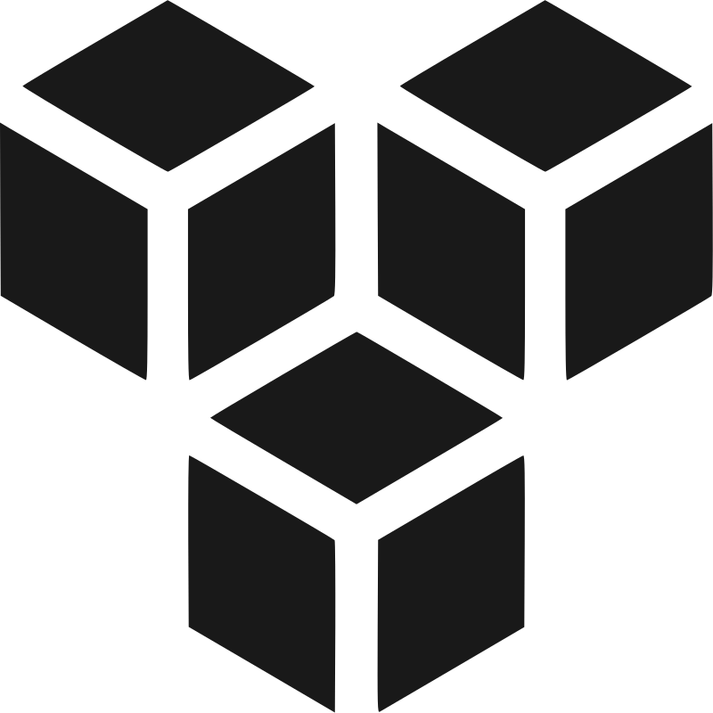

<h1>

Voxelify
</h1>


## Overview
**Voxelify** is a lightweight JavaScript library for rapid 3D voxel modeling and rendering with the powerful *VoxelMesh* object.

## Installation
1. Run the following command to install threefy via npm:
```sh
npm install voxelify
```
2. Once installed, you can import it into your project:
```js
import { VoxelMesh } from 'voxelify'
```
Now you’re ready to start using voxelify to create 3D voxel content!

## Basic Usage

#### Example 1: shows voxel generation from (x,y,z) points
```js
import { VoxelMesh } from 'voxelify'
import { TorusKnotGeometry } from 'three'

const randomHexColor = () => {
    let r = Math.round( Math.random() * 0xff )
    let g = Math.round( Math.random() * 0xff )
    let b = Math.round( Math.random() * 0xff )
    return ( ( r << 16 ) | ( g << 8 ) | b )
}

let x,y,z,c,t
const geometry = new TorusKnotGeometry( 20, 20*0.3, 200, 32 )
const position = geometry.getAttribute( 'position' )

const voxMesh = new VoxelMesh()
for ( let i = 0; i < position.count; i++ ) {
    x = position.getX(i)
    y = position.getY(i)
    z = position.getZ(i)
    c = randomHexColor() // optional
    t = undefined        // optional
    voxMesh.setVoxel( x, y, z, [ c, t ] )
}
voxMesh.createVoxelMesh()

scene.add( voxMesh ) // rendered by three.js
```

#### Example 2: shows voxel generation using atlas (texture map applied to each voxel)
```js
import { VoxelMesh } from 'voxelify'
import { MathUtils, TorusKnotGeometry } from 'three'

let x,y,z
const positions = []
const colors = []
const tiles = []
const geometry = new TorusKnotGeometry( 20, 20*0.3, 200, 32 )
const position = geometry.getAttribute( 'position' )

for ( let i = 0; i < position.count; i++ ) {
    x = position.getX(i)
    y = position.getY(i)
    z = position.getZ(i)
    positions.push( x, y, z )
    colors.push( 0xffffff )                  // optional
    tiles.push( MathUtils.randInt( 0, 15 ) ) // optional
}

const voxMesh = new VoxelMesh()
voxMesh.setAtlasTexture({
    uvScale:  [ 1/16, 1/4 ], // depends on the atlas below
    diffuseURL: 'images/atlas/sampleAtlas.png' // atlas URL
})
voxMesh.createFromPositions( positions, colors, tiles )

scene.add( voxMesh ) // rendered by three.js
```

#### Example 3: shows voxel rendering performance
```js
import { VoxelMesh } from 'voxelify'
import { Color, LinearSRGBColorSpace, MathUtils } from 'three'

const positions = []
const colors = []
const tiles = []
const col = new Color()
const meshSize = 128
const numVoxels = 300000 // max 6,000,000 for 60 FPS

const linearRand = ( min, max ) => ( min + Math.random() * ( max - min ) )

const xyz_to_hexColor = ( x, y, z ) =>
{
    x = Math.sin( x*0.1 )*0.5 + 0.5
    y = Math.cos( y*0.1 )*0.5 + 0.5
    z = Math.sin( z*0.1 )*0.5 + 0.5
    const hue = x * y * z
    const hexCol = col.setHSL( hue, 1, 0.5 ).getHex( LinearSRGBColorSpace )
    return hexCol
}

for( let i = 0; i < numVoxels; i++ )
{
    const x = linearRand( -meshSize, meshSize )
    const y = linearRand( -meshSize, meshSize )
    const z = linearRand( -meshSize, meshSize )
    positions.push( x, y, z )

    const hexCol = xyz_to_hexColor( x, y, z )
    colors.push( hexCol )

    const tileId = MathUtils.randInt( 0, 15 ) // tileId of atlas texture
    tiles.push( tileId )
}

const uvScale = [ 1/16, 1/4 ]
const atlas = { diffuseMap: 'images/atlas/sampleAtlas.png' }
const mtlProps = { roughness: 0.2, emissive: new Color(0x191919) }

const voxMesh = new VoxelMesh()
voxMesh.createFromPositions( positions, colors, tiles, uvScale, atlas, mtlProps )

scene.add( voxMesh ) // rendered by three.js
```

## VoxelMesh Class Structure

See the base [Mesh](https://threejs.org/docs/index.html?q=mesh#api/en/objects/Mesh) class for common properties.

| Constructor | Description |
| --- | --- |
| VoxelMesh() | Create a new VoxelMesh object |

| Properties | Type | Description |
| --- | --- | --- |
| .isVoxelMesh | Boolean | Read-only flag to check if a given object is of type VoxelMesh |
| .options | Object | Set the options for the generation <br> default options = { shelling: true /* kill the voxels inside */, ... } |
| .voxMap | Map | Define the map from voxel position (**vp**) to voxel data (**vox** = {**vc**, **vs**, **vr**}) <br> voxMap.set( **vp**, { **vc**, **vs**, **vr** } ) where **vp** = string or integer indicating the voxel position, **vc** = integer containing the tileId and color, **vs** = integer containing the size, opacity, and life, **vr** = integer containing rotional angles around (x,y,z) axis |
| .voxDim | Integer | Dimension of vox, if voxDim = 2, 3, 4, then we have vox = { vc }, { vc, vs }, { vc, vs, vr }, respectively |
| .voxType | String | Voxel type, which is one of '*cube*', '*box*', '*sphere*', '*cylinder*', '*tetrahedron*', '*octahedron*', or '*lego*' |
| .atlas | Object | (optional) Atlas texture, The *tileId* in vc points to a specific tile in the atlas texture |

| Methods | Return | Description |
| --- | --- | --- |
| .setAtlasTexture(atlas) | undefined | Set the atlas = { <br> &nbsp;&nbsp; tileSize: { x: tileSizeX, y: tileSizeY }, <br> &nbsp;&nbsp; texSize: { x: texSizeX, y: texSizeY } }, <br> &nbsp;&nbsp; diffuseURL: 'myFolder/myDiffuse.png', <br> &nbsp;&nbsp; normalURL: 'myFolder/myNormal.png' <br> } |
| .vp_to_xyz(vp) | Array | Get the voxel coordinate [x,y,z,w] from the *vp* (voxel position) |
| .xyz_to_vp(x, y, z, w=0) | String or Integer | Get the *vp* from (x,y,z,w) |
| .initVoxMap() | undefined | Initialize the voxMap |
| .clearVoxMap() | undefined | Clear the voxMap |
| .regenVoxMap() | undefined | Regenerate voxMap from .geometry.attributes.aVoxData |
| .setVoxel(x, y, z, vox) | undefined | Set the *vp* and *vox*, where *vp* = voxel position (string or integer), *vox* = [ hexCol, tileId, size, opacity, life, rotx, roty, rotz ] |
| .getVoxel(x, y, z) | Object | Get the vox from (x,y,z) |
| .findFaceNeighbors(vp) | Array | Find all voxels connected to 6 faces |
| .findEdgeNeighbors(vp) | Array | Find all voxels connected to 12 edges |
| .findVertexNeighbors(vp) | Array | Find all voxels connected to 8 vertices |
| .deleteVoxels(vps) | undefined | Delete the voxels pointed to by vp array |
| .addVoxels(vdatas) | undefined | Add the voxels where vdatas = [ [vp,vox], ...] where vox = { vc, vs, vr } |
| .createVoxelMesh() | undefined | Create the voxel mesh with the voxels predefined by setVoxel() |
| .raycast(raycaster, intersects) | undefined | Get intersections between a casted ray and this object |
| .getBoundingBox(space='local')| Box | Get the bounding box, where space is 'local' or 'world' |
| .getBoundingSphere(space='local')| Sphere | Get the bounding sphere, where space is 'local' or 'world' |
| .center() | undefined | Positions this object at the center of world coordinate system |
| .rotate(axis, theta) | undefined | Rotate *theta* angle about the *axis*  |
| .simplify(factor) | undefined | Simplify by *factor* where 0 < *factor* < 1 |
| .copy(source, recursive) | undefined | Copy the *source* into this object |
| .createFromPositions<br>(positions, colors, tiles, uvScale, atlas, mtlProps) | undefined | Create the voxel mesh with the following inputs (all optional except positions): <br> - positions = [ px,py,pz, ... ]<br> - colors = [ hexCol, ... ]<br> - tiles = [ tileId, ... ] (*tileId = tile id of atlas texture)<br> - uvScale = [ tileX / texX, tileY / texY ]<br> - atlas = { diffuseMap: 'myDiffuse.png', normalMap: 'myNormal.png' }<br> - mtlProps = { roughness: 0.2, wireframe: true, ... } |
| .loadVOX(url) | undefined | Load from url pointing to a file in VOX format |
| .saveVOX(filename) | undefined | Save this object as VOX format |

## Voxel Representation & Features

- **Data compression** is used to minimize data transfer volume.
- **JS heap memory** is deleted immediately after use.
- **Voxel volume** requires 4 bytes or 8 bytes per voxel.
    - For a 4-byte voxel, 256 colors are used.
    - For a 8-byte voxel, full-sized colors are used. (cf: atlas texture available)
- **Chunk structure**: not used for reducing memory waste, unlike existing research.
- **3D indexing approach**: not used for reducing performance degradation due to expensive multiplication, unlike existing research.
- **Rendering performance**: 6,000,000 voxels are rendered at 60 FPS on the PC: Intel(R) Core i7-6700 (16GB), NVIDIA GeForce GTX 1080.

## Voxel Modeling & Processing

- **Element types**: seven voxel geometries supported.
    - Cube: typical voxel shape
    - Box: variable in width, height, and thickness
    - Cylinder: variable radius and height
    - Sphere: possible changed to oval shape
    - Tetrahedron: magnification applicable in each direction
    - Octahedron: possible changed into diamond shape
    - Lego: basic form of Lego is supported (its size can be changed)
    - Custom: user-specific shapes will also be supported
- **Inquire**: we check whether a voxel exists at an offset distance from the current position of the voxel, and returns its value if it exists.
- **Topology**: three functions are provided for extracting neighboring voxels.
    - Face-connected: extracts 6 neighboring voxels that share 6 faces of a voxel
    - Edge-connected: extracts 12 neighboring voxels that share 12 edges of a voxel
    - Vertex-connected: extracts 8 neighboring voxels that share the 8 vertices of a voxel.
- **Boundary checking**: we check whether a specific voxel is in the boundary and returns true or false.
- **Affine transformation**: for example, voxel size can be scaled to reduce a memory waste caused by using a lot of voxels for large objects.
- **Ray intersection**: voxels are selected using a mouse (touch). This extends to voxel painting to enable voxel editing.
- **Creating from point cloud**: voxels are created from point data set, which does not require data order and has no problem with overlapping. It means 3D scanners can make voxels.
- **Shelling**: we delete voxels that exist inside the volume (invisible part) to minimize memory.
- **Filling**: we support the function of filling gaps such as holes on the boundary surface. Voxels lost in the middle of the surface can be restored.
- **Editing**: voxels are first selected through mouse event and ray intersection, then we perform the voxel addition and deletion using the neighbor information of selected voxels. All work is carried out in an interactive manner. Click the [link](https://youtu.be/R2ihW7gPpIw?si=WWpkmm8UTKhb0Mbp) to watch the YouTube demo.
- **VOX format**: this format is supported, widely used in the voxel ecosystem.

## PBR-based Voxel Rendering

- **PBR materials**: shaders for physically-based rendering are supported, based on three.js.
- **ATLAS Texture**: supported along with PBR shaders to increase the realism of VR and game worlds.
- **Frustum culling**: voxels not rendered, which exist outside the viewing space.
- **Occlusion culling**: voxels not rendered, which are hidden by other objects so are not visible to the camera.
- **Ambient occlusion**: our shader program calculates how exposed each point in a scene is to ambient lighting by counting the presence of neighboring voxels.

## Voxel Dynamics & Simulation

- **Compact structure**: VoxelMesh does not use 32 x 32 x 32 chunks of memory to define a few voxels, while most current voxel engines use the chunks. Our VoxelMesh uses only as much memory as it uses, so memory usage can be drastically reduced.
- **GPU computation**: VoxelMesh uses one thread per voxel so that each voxel can simultaneously perform the same algorithm. In other words, GPU-based programming is possible, which enables real-time animation development.
- **Signed distance functions**: You can easily render a signed distance function (SDF) without any special algorithm. Therefore, various modeling operation functions of SDF can be used without modification. On the other hand, in the case of existing polygon models, the expensive marching cubes algorithm is required.
- **Particle dynamics**: VoxelMesh includes a dual structure. One is that it supports a grid network like a general voxel engine, and the other is that it can implement particle dynamics which is hardly possible in existing voxel engines. For example, water simulation can be implemented using the PIC or FLIP algorithm.
- **Animation properties**: VoxelMesh has 4 properties for voxel animation. These include size, opacity, life, and rotation. Their total size is 2 bytes.
- **Celluar automata**: VoxelMesh can simulate several types of celluar automata (CA) studied in various areas, including physics, theoretical biology and microstructure modeling.

## Application Examples

- **3D fractals**: We create 3D fractals that are a range of chaotic equation-based objects, most often derived from the Mandelbrot set. Typical examples include Mandelbulb, Menger sponge, Juliabulb, Sierpinski tetrahedron, etc. These 3D models are quickly created and rendered in 3D space using the GPU.
- **3D celluar automata**: We build 3D voxels, called 3D cellular automata that are a collection of cells arranged in three-dimensional space, where each cell changes its state as a function of time according to a defined set of rules.
- **Iterated function system**: We create 3D voxels from an iterated function system (IFS) which generates a 3D fractal by iterative equations (2D) or a set of transformations (3D).
- **SDF-based raymarch**: The SDF(signed-distance function) is used to define the shape and rendering properties of the 3D model, and the ray-march approach is used to generate the final 3D voxel models. By compositing multiple SDF models, more complex voxel models can be created.
- **3D tween**: We create a voxel model at one specific frame in the timeline. And, change that voxels at another specific frame. Animate then interpolates the intermediate models for the frames in between, creating the animation of one voxels morphing into another.

> NOTE: Some of the features require [gpu.js](https://gpu.rocks/#/), which can be downloaded from [npm](https://www.npmjs.com/).

## Contact Us
Please contact us at info@nova-graphix.com for any questions or suggestions.
- Website: https://www.nova-graphix.com
- LinkedIn: https://www.linkedin.com/company/novagraphix/
- Facebook: https://www.facebook.com/NovaGraphixCo
- YouTube: https://www.youtube.com/@3D-novagraphix

## License
This project is licensed under the MIT License.